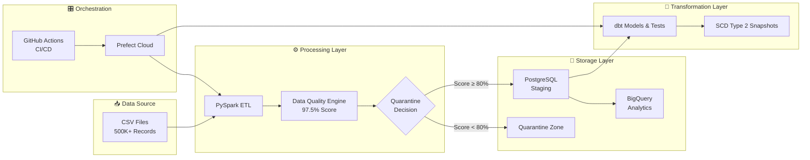

# Production-Grade ETL Pipeline

<p align="center">
  
  
  
  
</p>

<p align="center">
  
  
  
  
  
  
  
  
</p>

<p align="center">
  <strong> "Making Data Trustworthy at Scale" </strong>
</p>


<br>


A modern, scalable batch ETL pipeline that processes 500K+ orders with 97.5% data quality, automated quarantine logic, dbt transformations, and dual cloud warehousing.

Built with best practices: observability, CI/CD with manual approval, Docker, and production-ready deployment.


## Architecture



## Pipeline In Action

### Data Quality Engine


### BigQuery Load Success


### Pipeline Execution Logs


## Why This Pipeline?

Most data pipelines:
- ❌ Break silently in production
- ❌ Load garbage data
- ❌ Have no observability
- ❌ Bad Security and quality checks
- ❌ Not enough tests 

**This pipeline fixes all of that.**

---
## Key Features

- High-Performance Processing using PySpark that efficiently handles 500K+ rows with duplicate removal and schema inference
- Advanced Data Quality Engine with automated scoring across 11 columns and intelligent quarantine system
- Modern Transformations using dbt with incremental models, SCD Type 2 snapshots, custom macros, and tests
- Dual Warehousing setup with PostgreSQL for staging and BigQuery for analytics (with proper partitioning and clustering)
- Full Containerization using Docker with multi-stage builds and health checks
- Production-grade CI/CD using GitHub Actions with security scanning, manual approval gates, and deployment tagging
- Robust Orchestration using Prefect Cloud (migrated from Airflow for better developer experience)

## Data Quality Highlights

- Average Quality Score: 97.5%
- Total Rows Processed: 500,000+
- Quarantine Logic: Automatically isolates rows below 80% quality threshold
- Invalid Data Detected: ~2.5% of records (auto-quarantined)
- Columns Validated: 11 critical columns

## Tech Stack

- Processing: PySpark
- Orchestration: Prefect Cloud
- Transformations: dbt (models, snapshots, macros, tests)
- Warehousing: BigQuery + PostgreSQL
- Containerization: Docker + Docker Compose
- CI/CD: GitHub Actions
- Data Quality: Custom scoring engine + quarantine logic
- Monitoring: Logging + Prefect Cloud

## What I Learned

- Data quality must be enforced before loading, not after — bad data can poison downstream analytics
- Modern orchestration tools like Prefect offer significantly better developer experience than traditional tools for mid-size pipelines
- Proper CI/CD with manual approval gates and deployment tagging dramatically increases confidence in production deployments
- Cloud warehousing best practices (partitioning + clustering) have a massive impact on both cost and query performance


---
## Documentation

- [ETL-Pipeline](etl-pipeline/etl_pipeline.py)
- [Data Tests](dbt/models/Tests/)
- [Prefect Flow Documentation](orchestration/Prefect/etl_flow.py)
- [CI/CD Pipeline Details](.github/workflows/)
- [Sample Tests](samples/)

---

## Troubleshooting

| Issue | Solution |
|-------|----------|
| `docker-compose up` fails | Make sure Docker Desktop is running and you have copied `.env.example` to `.env` |
| Permission error on volumes | Run `docker-compose down -v` then `docker-compose up --build` |
| BigQuery authentication error | Set up your `GOOGLE_APPLICATION_CREDENTIALS` in `.env` |
| dbt model failures | Run `dbt debug` and check connection to BigQuery/PostgreSQL |
| Prefect flow not visible | Check you're logged in with `prefect cloud login` |
| High memory usage | Increase Docker resource limits or reduce Spark partitions |

---

## Roadmap
- [x] Built scalable PySpark ETL pipeline handling 500K+ records
- [x] Implemented advanced Data Quality Engine with 97.5% score + quarantine logic
- [x] Integrated dbt for transformations (incremental models, SCD Type 2, tests)
- [x] Set up dual warehousing (PostgreSQL staging + BigQuery analytics)
- [x] Containerized with Docker + multi-stage builds
- [x] Implemented CI/CD with GitHub Actions (manual approval + security scanning)
- [x] Migrated orchestration from Airflow to Prefect Cloud
- [x] Added comprehensive logging and monitoring
- [x] Cost monitoring & optimization alerts
- [x] Multi-environment support (dev/staging/prod)
- [x] Deepening DBT
- [x] Deepening BigQuery
- [ ] Improve Quality Checks
- [ ] Fix hardcoded values
- [ ] Fix Monolithic script
- [ ] Add CI/CD for DBT

## Quick Start
``` bash
git clone https://github.com/AM7013/production-ETL-pipeline.git

cd production-ETL-pipeline

cp .env.example .env

docker-compose up --build
```

## Structure
``` text
production-ETL-pipeline/
├── .github/
│   └── workflows/
│       ├── prefect-ci.yml
│       └── prefect-cd.yml
├── Screenshot/                  # Screenshots for README
├── dbt/                         # dbt project
│   ├── macros/
│   ├── models/
│   ├── snapshots/
│   ├── tests/
│   └── ... (other dbt folders)
├── etl-pipeline/                # Core ETL logic
├── orchestration/               # Prefect flows
│   └── Prefect/
│       └── etl_flow.py
├── samples/                     # Sample data
│   └── cleaned_data_test.csv
├── sandbox/                     # Experimental code
├── .dockerignore
├── .env.example
├── .gitignore
├── .prefectignore
├── .trivyignore
├── Dockerfile
├── LICENSE
├── README.md
├── requirements.txt
├── run_cd.py
└── (other root files)
```
## License

MIT License - see LICENSE file for details.
