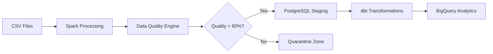

# Production-Grade ETL Pipeline

A modern, scalable batch ETL pipeline that processes 500K+ orders with 97.5% data quality, automated quarantine logic, dbt transformations, and dual cloud warehousing.

Built with best practices: observability, CI/CD with manual approval, Docker, and production-ready deployment.

## Architecture

## Key Features

- High-Performance Processing using PySpark that efficiently handles 500K+ rows with duplicate removal and schema inference
- Advanced Data Quality Engine with automated scoring across 11 columns and intelligent quarantine system
- Modern Transformations using dbt with incremental models, SCD Type 2 snapshots, custom macros, and 20+ tests
- Dual Warehousing setup with PostgreSQL for staging and BigQuery for analytics (with proper partitioning and clustering)
- Full Containerization using Docker with multi-stage builds and health checks
- Production-grade CI/CD using GitHub Actions with security scanning, manual approval gates, and deployment tagging
- Robust Orchestration using Prefect Cloud (migrated from Airflow for better developer experience)

## Data Quality Highlights

- Average Quality Score: 97.5%
- Total Rows Processed: 500,000+
- Quarantine Logic: Automatically isolates rows below 80% quality threshold
- Invalid Data Detected: ~2.5% of records (auto-quarantined)
- Columns Validated: 11 critical columns

## Tech Stack

- Processing: PySpark
- Orchestration: Prefect Cloud
- Transformations: dbt (models, snapshots, macros, tests)
- Warehousing: BigQuery + PostgreSQL
- Containerization: Docker + Docker Compose
- CI/CD: GitHub Actions
- Data Quality: Custom scoring engine + quarantine logic
- Monitoring: Logging + Prefect Cloud

## What I Learned

- Data quality must be enforced before loading, not after — bad data can poison downstream analytics
- Modern orchestration tools like Prefect offer significantly better developer experience than traditional tools for mid-size pipelines
- Proper CI/CD with manual approval gates and deployment tagging dramatically increases confidence in production deployments
- Cloud warehousing best practices (partitioning + clustering) have a massive impact on both cost and query performance

## Quick Start

git clone https://github.com/AM7013/production-ETL-pipeline.git
cd production-ETL-pipeline

## Structure
The repository is organized by function:

**src/** — ETL logic (extract, transform, load, quality)
---
**orchestration/** — Prefect flows (and legacy Airflow DAGs)
---
**transformations/** — dbt models, snapshots, macros, tests
---
**infrastructure/** — Dockerfiles and compose
---
**tests/** — Unit and integration tests
---
**.github/** — CI/CD pipelines
For a detailed view, explore the repository directly.

## License

MIT License - see LICENSE file for details.
